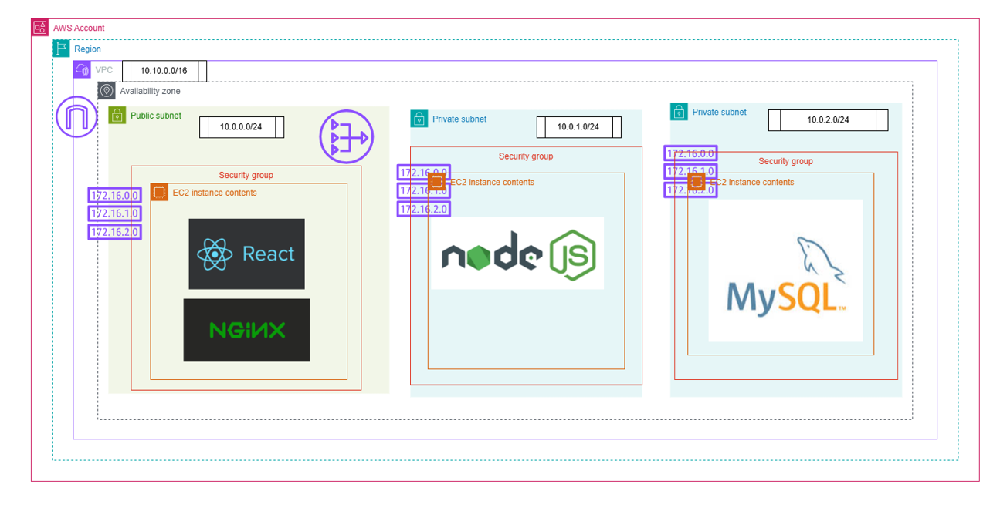

<h1 align="center">☁️ Cloud and DevOps Circle</h1>
<p align="center">
  <i>A collaborative space to learn, build, and master Cloud & DevOps concepts through real-world projects.</i>
</p>

<p align="center">
  
  
  
</p>

---

## 📘 About the Repository

The **Cloud and DevOps Circle** repository is a collection of projects, architecture demos, and automation experiments focused on **Cloud Computing** and **DevOps Engineering**.

Each project inside this repo is designed to:
- Demonstrate **industry-grade architecture patterns**
- Explore **DevOps automation pipelines**
- Apply **AWS, Azure, and GCP services**
- Reinforce **containerization and deployment best practices**

---

## 🏗️ Project 1: Three Tier Architecture

### 🧩 Overview
The **Three-Tier Architecture** project is a foundational cloud deployment model that separates an application into three logical layers:
1. **Frontend (Presentation Layer)**
2. **Backend (Application Logic Layer)**
3. **Database (Data Storage Layer)**

<p align="center">
  
</p>

### ⚙️ Tech Stack

| Layer | Technology | Description |
|--------|-------------|-------------|
| Frontend | React / HTML / CSS / JS | User Interface hosted on S3 or EC2 |
| Backend | Node.js / Express | RESTful API service |
| Database | MySQL / MongoDB | Persistent data storage |
| Cloud | AWS (EC2, S3, RDS, IAM, VPC) | Scalable cloud infrastructure |


---

## 🧰 Repository Structure

```bash
Cloud_and_DevOps_Circle/
├── ThreeTierArchitecture/
│   ├── frontend/         # React or static web app
│   ├── backend/          # Node.js API service
│   └── README.md         # Project-specific details
└── README.md             # This file
